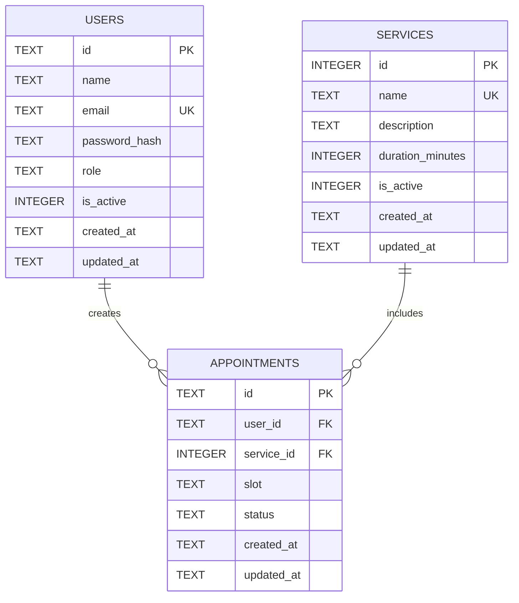

# 資料庫設計

## ER Diagram

## 資料表用途

### users

儲存使用者帳號及角色。

- `id`：使用者唯一識別碼
- `email`：登入帳號，不可重複
- `password_hash`：密碼雜湊，不儲存明文密碼
- `role`：`customer` 或 `admin`
- `is_active`：帳號是否啟用

### services

儲存可以預約的服務項目。

- `id`：服務唯一識別碼
- `name`：服務名稱
- `duration_minutes`：服務所需分鐘數
- `is_active`：服務是否開放預約

### appointments

儲存使用者建立的預約。

- `id`：預約唯一識別碼
- `user_id`：關聯到 `users.id`
- `service_id`：關聯到 `services.id`
- `slot`：預約時段
- `status`：預約狀態
- `created_at`：建立時間
- `updated_at`：最後修改時間

## 關係

- 一個使用者可以建立多筆預約。
- 一項服務可以出現在多筆預約中。
- 一筆預約只能屬於一個使用者。
- 一筆預約只能選擇一項服務。

## 商業規則

- 使用者角色只能是 `customer` 或 `admin`。
- 預約狀態只能是 `pending`、`confirmed`、`completed` 或 `cancelled`。
- `pending` 與 `confirmed` 的預約不可占用相同時段。
- `cancelled` 的預約會保留紀錄，但該時段可以再次預約。
- 服務不直接從資料庫刪除，停用時將 `is_active` 設為 `0`。
- 一般使用者只能查看及操作自己的預約。
- 管理者可以查看全部預約、調整狀態及維護服務。